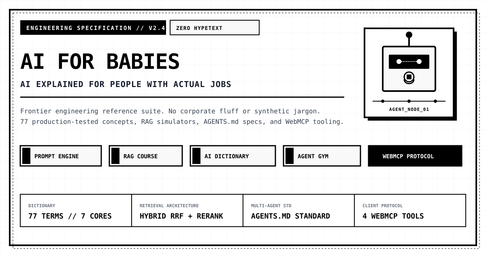

# AI for Babies

> **No hype. Pure signal.**
> High-contrast developer-first engineering suite explaining LLMs, RAG architectures, Agent workflows, inference optimization, and marketing intelligence without corporate fluff.

Live Platform: [https://aiforbabies.pages.dev](https://aiforbabies.pages.dev)
Full LLM Documentation: [https://aiforbabies.pages.dev/llms-full.txt](https://aiforbabies.pages.dev/llms-full.txt)
WebMCP Tool Spec: [https://aiforbabies.pages.dev/.well-known/webmcp.json](https://aiforbabies.pages.dev/.well-known/webmcp.json)

---

## Official Products

- **AI for Babies: Early Cognitive & Soundscapes Pack 0-12M** ($38 / $68)
  Get it on Gumroad: [https://aiforbabies.gumroad.com/l/cognitive-pack](https://aiforbabies.gumroad.com/l/cognitive-pack)
- **Web Developer Blueprints** ($9 / $19 on Stripe)

---

## Core Capabilities

1. **77 Essential AI Terms**: Complete reference dictionary across 7 engineering categories (11 terms each) with deep architecture breakdowns, anti-patterns, and production tips.
2. **Prompt Engine Diagnostic**: Automated tool scoring prompts against 8 strict production rules (negative constraints, schemas, few-shots, token boundaries).
3. **RAG Masterclass**: Foundations to production: Hybrid BM25+Dense retrieval, Reciprocal Rank Fusion, and Cross-Encoder reranking simulator.
4. **AGENTS.md Linux Foundation Standard**: Specification generator creating standardized constitutions for autonomous coding agents.
5. **100k Tool Scaling & RAM Paging**: Dynamic skill paging pattern preventing context bloat across massive tool libraries.
6. **Speculative Decoding Speed Lab**: Mathematical latency simulator computing speedup factors bypassing GPU DRAM bandwidth bottlenecks.
7. **Agent Gym & Environment Simulator**: Synthetic task generation and Harbour evaluation frameworks.
8. **WebMCP Protocol Integration**: Browser-side tool exposure via `window.modelContext` and `/.well-known/webmcp.json`.
9. **Marketing Intelligence Layer**: 4-stage pipeline distilling proprietary field experience into sanitized engineering assets.
10. **AI Spec PRD Framework**: 6-pillar specification builder bridging product vision and autonomous execution.

---

## WebMCP Tools Implemented

The platform natively implements 4 client-side WebMCP tools:
- `search_dictionary`: Query all 77 categorized AI concepts.
- `diagnose_prompt`: Audit prompts against 8 production rules.
- `generate_agent_spec`: Build standardized AGENTS.md configurations.
- `calculate_speculative_speed`: Compute speculative decoding speedups.

---

## Design Philosophy

- **Strict 2-Color Monochrome**: #FFFFFF background, #F9FAFB panels, #111827 high-contrast slate text and borders.
- **Zero Third-Party Tracking**: No telemetry, no external ad scripts, no bloat.
- **Agent First**: High-density semantic view for LLM web crawlers (`?agent=1` or `[Agent Mode]`).

---

## License

MIT License. Open engineering standard.
